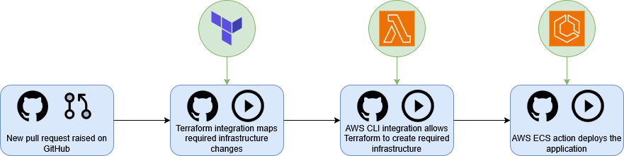
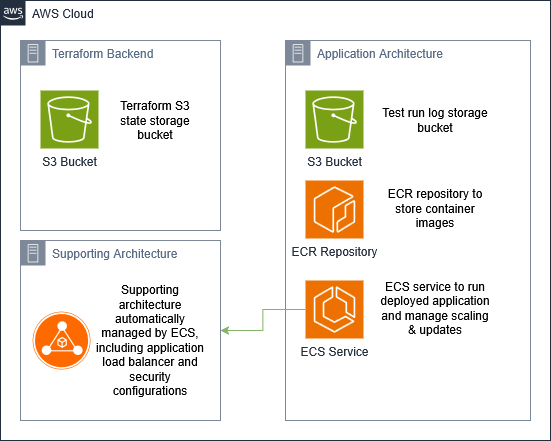
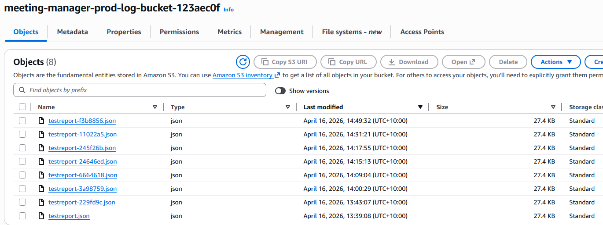
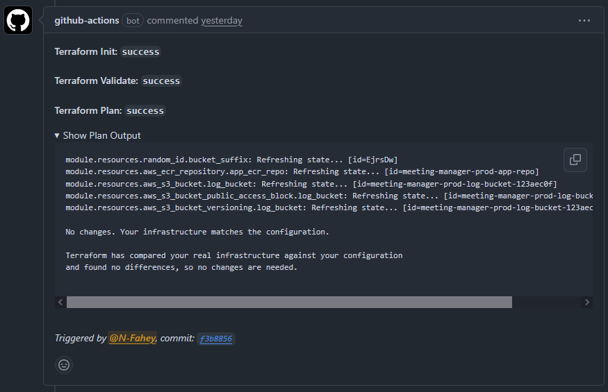
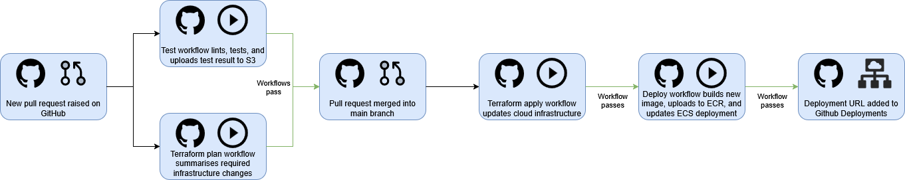

# Meeting Scheduler

A lightweight API to create & manage meeting requests.

## Installation

1. Clone the repo
2. Run `npm install` to install dependencies
3. Create a `.env` file in the root directory and add the following variables:

```
HOST=0.0.0.0
PORT=3000
MONGO_URI=your_mongodb_uri
JWT_SECRET=your_jwt_secret
```

4. Run `npm start` to start the server

## Terraform Setup

1. Install Terraform
2. Create an S3 bucket for storing Terraform state files
3. Configure AWS CLI with your AWS credentials
4. Create a `terraform.tfvars` file in the root directory and add the following variables:

```hcl
aws_region   = "your_aws_region"
project_name = "meeting-manager"
```

5. Initialise Terraform with S3 backend configuration:

```terraform init \
	-backend-config="bucket=your_s3_terraform_state_bucket_name" \
	-backend-config="key=terraform/meeting-manager/tf-state" \
	-backend-config="region=your_aws_region"
```

6. Run `terraform plan` to see the execution plan
7. Run `terraform apply` to apply the changes and create the infrastructure

## Workflow Environment Variables

- APP_HOST - Host for the application; set to 0.0.0.0 to allow external connections when deployed in a containerized environment.
- APP_PORT - Port for the application.
- AWS_REGION - AWS region where the infrastructure is deployed; used for AWS CLI commands and SDK interactions.
- BUCKET_TF_STATE - Name of the S3 bucket used to store Terraform state files; used in backend configuration.
- BUCKET_TF_KEY - Key for the Terraform state file in the S3 bucket; used in backend configuration.
- PROJECT_NAME - Project name; used for naming AWS resources and in Terraform configurations.

## Workflow Environment Secrets

- APP_JWT_SECRET - JWT secret for the application; used to sign and verify JWTs for authentication and authorization.
- APP_MONGO_URI - MongoDB connection URI for the application; used to connect to the database where user and meeting data is stored.
- AWS_ECS_EXECUTION_ROLE - AWS IAM role ARN for ECS task execution; grants ECS tasks permission to interact with other AWS services.
- AWS_ECS_INFRASTRUCTURE_ROLE - AWS IAM role ARN for ECS infrastructure; grants ECS permission to manage infrastructure resources.
- AWS_ROLE_ARN - AWS IAM role ARN used to log in to the AWS CLI for workflow operations.

## CI/CD Tools & Services
### GitHub Actions - for CI/CD workflow automation
GitHub Actions was chosen for its seamless integration with GitHub repositories, ease of use, and an extensive marketplace of pre-built actions to simplify workflow setup. It allows for easy configuration of workflow triggers, job dependencies, and environment variables & secrets, making it an ideal choice for this project. Integrations with other CI/CD tools such as Terraform and the AWS CLI are also available, further simplifying workflow setup and maintenance. Alternatives to GitHub Actions include dedicated CI/CD platforms such as Jenkins, or integrations with other version control platforms such as GitLab CI/CD and Bitbucket Pipelines. GitHub Actions was chosen over these alternatives for its direct integration with GitHub (where the codebase is hosted) and its ease of integration with the other selected tools and services.
  
*Simplified integration diagram showing how GitHub Actions integrates with other tools & services used in this project.*

### Terraform - for Infrastructure as Code (IaC) management
Terraform is used to manage the infrastructure required for the project, including AWS resources such as an S3 bucket for test-run log storage, ECR for container image storage, and ECS for application deployment. Terraform was selected for its ability to integrate infrastructure management with version control, allowing infrastructure changes to be tracked and audited alongside source code changes. Terraform includes an extensive marketplace of providers (including AWS), which simplifies infrastructure definition and deployment. Alternatives to Terraform include cloud-integrated IaC tools such as CloudFormation (AWS) and more code-based tools such as Pulumi. Terraform was chosen over these alternatives for its extensive provider marketplace and strong integration with version control, in addition to its familiarity and widespread industry adoption.

### AWS - for cloud infrastructure and deployment services
AWS is used to host the infrastructure & services for the application. The AWS architecture for this project includes S3 for long-term storage of test-run history, ECR for container image storage, and ECS for application deployment. AWS was chosen for its flexible free-tier offerings, providing all services necessary for this project. In addition, AWS has strong integrations with Terraform and GitHub Actions, simplifying the CI/CD workflow and any future maintenance requirements. Alternatives to AWS include other cloud providers like Google Cloud Platform and Microsoft Azure with similar service offerings. AWS was chosen over these alternatives primarily for its free-tier offerings and familiarity.
  
*Diagram showing the AWS services used in this project.*

## CI/CD Workflow Explanation
The CI/CD workflow is designed to cover automated testing, architecture provisioning, and application deployment. The workflows are triggered by either a push to the main branch, a pull request, the successful completion of another workflow, or manually. Depending on the trigger, the workflow executes a series of jobs that ultimately update the live deployment of the application.

### Pull Request Workflow
When a pull request is opened against the main branch, two separate workflows are triggered. The first workflow (*test.yml*) runs a series of automated tests against the code changes, including a linting check. Any failing tests will cause the workflow to fail, preventing the pull request from merging into the main branch until the issues are resolved. The workflow additionally saves the test-run logs to a custom log file, which is uploaded to an S3 bucket with a unique identifier based on the Git commit SHA.
  
*Screenshot showing test report log files in S3, with unique identifiers corresponding to Git commit SHAs.*  

The second workflow (*terraform_plan.yml*) runs a series of Terraform commands, including `terraform fmt` to check for syntax errors in the Terraform code, `terraform validate` to check for any configuration issues, and `terraform plan` to generate an execution summary of any infrastructure changes that would be applied by the pull request. The output of these commands is then saved as a comment on the pull request, providing visibility of any infrastructure changes in a clear and accessible format.
  
*Screenshot of Terraform plan output as PR comment.*  

### Push to Main Workflow
When a push is made to the main branch, including after a pull request is merged, a third workflow (*terraform_apply.yml*) is triggered. This workflow runs the same `fmt` and `validate` commands, but instead of saving the output as a comment, it executes `terraform apply` to deploy any infrastructure changes. The workflow completes once the infrastructure changes are applied.

### Workflow Run Trigger
The deployment of the application is handled in a separate workflow (*deploy.yml*). This workflow is triggered on the successful completion of the previous *terraform_apply.yml* workflow, or it can be triggered manually. This workflow is split across two jobs: the first builds a container image from the latest code in the main branch, then tags the image with the Git commit SHA and pushes it to ECR. This job outputs the image URI for use in the second job, which redeploys the ECS service with the new ECR image URI. ECS automatically handles deployment of the new image, including provisioning a new task definition and application instance, health checks, and finally decommissioning the outdated application instance. The workflow completes only once the new version of the application is fully deployed.


### Manual Trigger
The deployment workflow, and a final decommissioning workflow (*terraform_destroy.yml*), can also be triggered manually. This allows for manual redeployments of the application if necessary, and for the complete teardown of application infrastructure as required.

### Workflow Flow Diagram

*Diagram showing the CI/CD workflow, including triggers and jobs.*

### Endpoints

- Auth
    - Register
    - Login
- Meeting
    - Create
    - Invite (host can post to invite a user or list of users to existing mtg)
    - Respond (invitee can respond to a meeting, accept/decline)
    - Update (change meeting name, description)
    - Cancel
